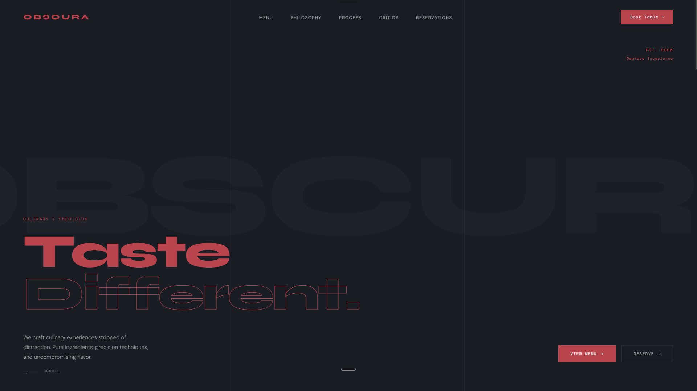
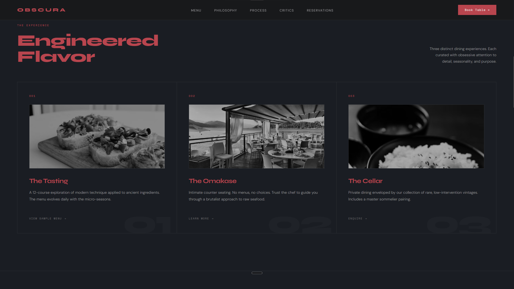
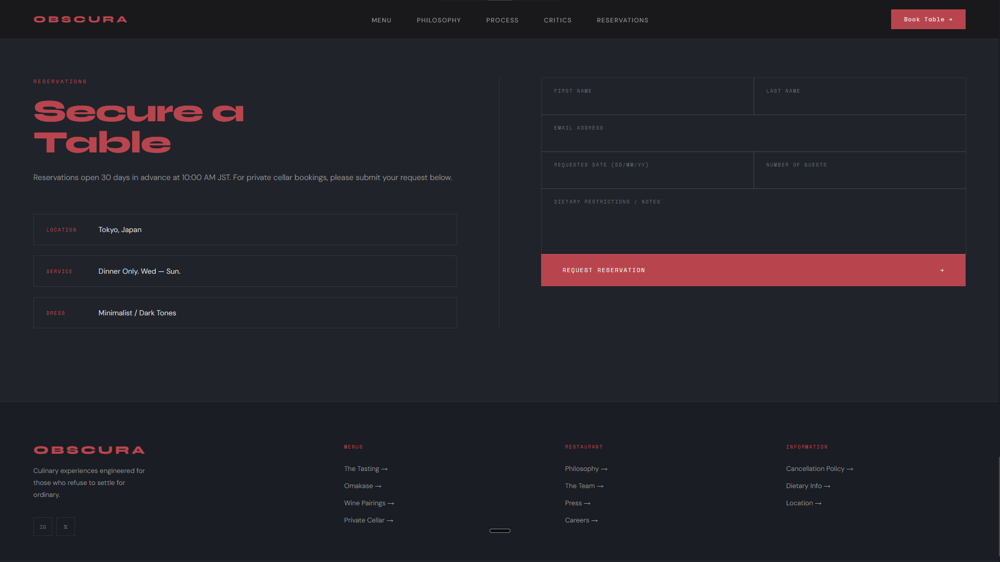

# OBSCURA

Fine dining, stripped of noise.

🔗 **Live:** https://obscura.akshaycodecrafter.workers.dev/

## Preview


*The hero opens with the OBSCURA wordmark, a two-line headline, and the Omakase Experience positioning in the top-right corner.*


*The products grid shows the three dining experiences — The Tasting, The Omakase, and The Cellar — with grayscale-to-color hover transitions on the imagery.*


*The reservations section features a minimal contact form with floating labels against the dark wine-red accent palette.*

## About

I wanted to build a restaurant site that didn't feel like every other restaurant site — no soft pastel palettes, no stock photography of smiling chefs, no carousel of testimonials scrolling on autoplay. OBSCURA is a fictional Tokyo fine-dining concept built around precision and restraint, and I wanted the site itself to feel like that: dark, deliberate, a little brutalist. If the food is about stripping a dish down to what actually matters, the site should do the same with its layout.

## What's on the page

- **Nav** — sticky navigation with quick links to every section, plus a reservation CTA
- **Hero** — the opening statement: brand name, tagline, and the "Omakase Experience" positioning
- **Menu** — a look at what's actually served, laid out without clutter
- **Philosophy** — the thinking behind the food and the space
- **Process** — how a dish comes together, step by step
- **Critics / Reviews** — third-party perspective on the experience
- **Reservations** — the contact and booking section

## Built with


- Plain HTML, CSS, and JavaScript — no framework, no build step
- CSS custom properties for the color system (dark background, wine-red accent)
- Scroll-triggered reveal animations and a count-up effect, both vanilla JS

## Why I built it this way

No framework was a deliberate choice, not a shortcut. A single-page site like this doesn't need React or a bundler — it needs fast load times and layout that doesn't shift while scroll animations fire, and plain CSS/JS gets there with the least overhead. The one thing I did pull back on: an earlier version had a custom animated cursor (a dot + trailing ring) following the mouse. It looked slick in isolation, but on a site about precision and clarity, a cursor effect that lags behind your mouse movement works against the feeling I was going for — so it came out, and the default pointer stayed.

## Running it locally

```
OBSCURA/
├── index.html
├── assets/
│   └── favicon.svg
├── css/
│   └── style.css
└── js/
    └── script.js
```

No build step, no dependencies. Clone the repo and just open index.html in a browser.

## Status

Demo/concept build. Restaurant, menu, and reservation details are illustrative, not a real business.
